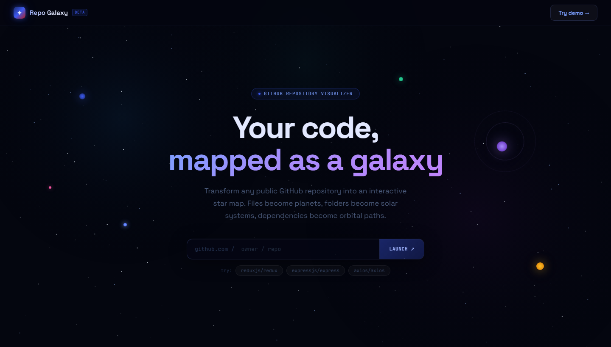
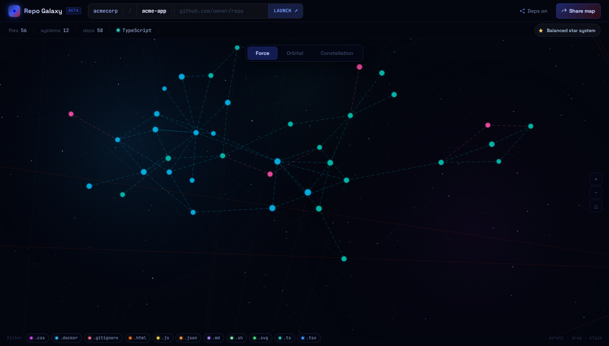
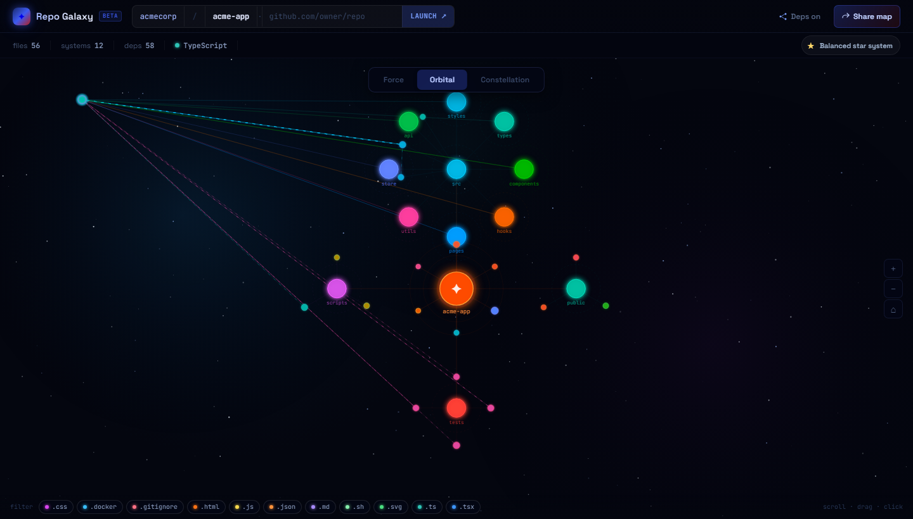
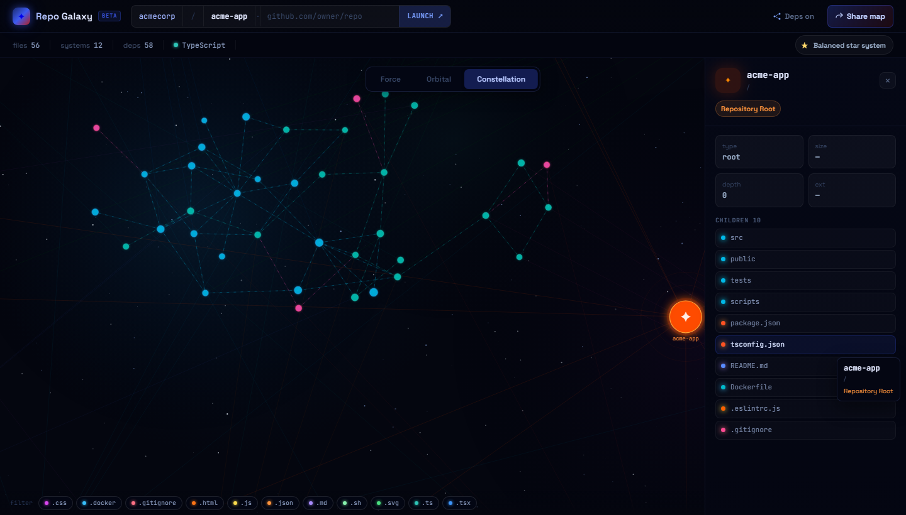

# Repo Galaxy

Repo Galaxy is a web app that turns a public GitHub repository into an interactive galaxy map. Files become planets, folders become solar systems, and supported JavaScript/TypeScript imports become dependency links.

## Screenshots









## Features

- Public GitHub repo loading from `github.com/owner/repo`
- D3-powered galaxy canvas with force, orbital, and constellation views
- File extension filters and dependency link toggle
- Node inspector for parent, child, import, and used-by relationships
- Best-effort JS/TS import analysis for relative imports
- Shareable URL state for repo, view mode, and filters
- Responsive dark space UI based on the Claude Design prototype

## Tech Stack

- React
- TypeScript
- Vite
- D3
- Vitest
- Playwright

## Getting Started

Install dependencies:

```bash
npm install
```

Run the dev server:

```bash
npm run dev
```

Open:

```text
http://127.0.0.1:5173
```

## Scripts

```bash
npm run dev      # Start Vite dev server
npm run build    # Typecheck and build production assets
npm test         # Run unit tests
npm run e2e      # Run Playwright browser tests
```

## GitHub Analysis Notes

The MVP uses public GitHub APIs and does not require authentication. It fetches the repository tree, builds folder/file nodes, and scans a capped set of JS/TS-family source files for static imports, re-exports, dynamic string imports, and simple `require(...)` calls.

Dependency links are best-effort and currently resolve relative imports only.
